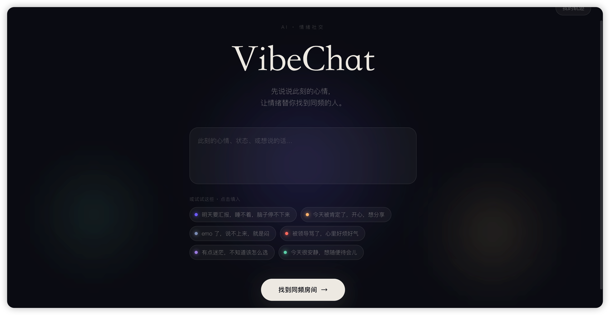

# VibeChat · 情绪同频的匿名房间

> 先说说此刻的心情，让情绪替你找到同频的人。

🌐 **在线体验**：**https://vibechat.wukangkang.com**

<p align="center">
  
</p>

VibeChat 是一款 **AI 情绪社交 Web 应用**。在这里，你不需要加好友、不需要露脸——只需写下此刻的心情，AI 会读懂你的情绪色彩，把你送进一间和此刻同频的**匿名情绪房间**，和有着相似感受的人实时相聚。

每一间房都是一个鲜活的「情绪场」：成员的情绪汇聚成房间的氛围色与共鸣度，让你真切感受到——此刻，有人和我一样。

## ✨ 核心特性

- **情绪读懂你**：心情文本经 AI 解析为情绪向量，生成专属的情绪色彩与一句温柔的解读。
- **同频相聚**：按情绪相似度匹配到 12 间主题情绪房，落点最同频的那间。
- **实时情绪场**：房间氛围色与共鸣度随成员情绪实时流动，氛围看得见。
- **AI 房间主持**：自然地破冰、接住冷场，并在你离开时送上一段回望。
- **温柔匿名**：进房即获得一个情绪化的昵称与几何头像，颜色与形状随你的心情而变。
- **情绪轨迹**：每一次心情与离场总结都被本地珍藏，可导出为一张精美的情绪卡片。

## 🧱 技术栈

| 层 | 技术 |
|----|------|
| 前端 | Next.js 16 · React 19 · TypeScript · Tailwind v4 |
| 后端 | FastAPI（异步）· SQLAlchemy 2.0 · SQLite · WebSocket |
| AI | 双标准 LLM 适配层，同时兼容 OpenAI 与 Anthropic 接口，可一键切换提供商 |

## 🔄 产品流程

```
写下心情 ──▶ AI 读懂情绪色彩 ──▶ 匹配同频房间 ──▶ 匿名实时群聊 ──▶ 离场回望
   │              │                   │                 │               │
 文本输入     情绪向量 + 解读       相似度匹配       WebSocket · AI 主持   情绪轨迹卡片
```

## 🏗️ 架构

```
浏览器 ──HTTPS / WSS──▶ 反向代理
                          ├── /            ─▶ Next.js      前端
                          ├── /api/        ─▶ FastAPI       REST
                          └── /api/ws/     ─▶ FastAPI       WebSocket

FastAPI ──▶ LLM（OpenAI 或 Anthropic 兼容端点，环境变量切换）
        └─▶ SQLite（会话 / 情绪分析 / 房间 / 消息）
```

后端核心模块：`llm/`（双接口适配层）· `services/`（情绪匹配、情绪场、AI 主持、匿名身份、安全）· `routers/`（REST）· `ws/`（房间实时聊天）。

## 🚀 本地开发

```bash
# 后端
cd backend
python3 -m venv .venv && source .venv/bin/activate
pip install -r requirements.txt
cp .env.example .env      # 在 .env 中配置你的 LLM 密钥
uvicorn app.main:app --reload

# 前端
cd frontend
npm install
npm run dev
```

打开 http://localhost:3000 即可体验。环境变量说明见 `backend/.env.example` 与 `frontend/.env.example`。

## 📂 项目结构

```
VibeChat/
├── backend/          FastAPI 服务
│   ├── app/
│   │   ├── llm/         双标准 LLM 适配层
│   │   ├── services/    matching · mood_field · host_service · identity · safety
│   │   ├── routers/     REST 接口
│   │   ├── ws/          房间实时聊天
│   │   └── seeds/       12 间预设情绪房
│   └── tests/
├── frontend/         Next.js 应用（首页 · 分析 · 房间 · 历史）
└── docs/             设计文档与实现计划
```

## 📌 项目背景

VibeChat 探索「AI · 情绪疗愈 · 轻社交」的交汇：用 AI 读懂情绪，用匿名降低表达门槛，用同频相聚缓解孤独。它不是专业心理治疗，而是为那些「只是想说说话」的时刻，提供一个温柔的落脚处。

如遇情绪困扰，请寻求专业帮助——应用内提供求助入口。

## License

MIT
